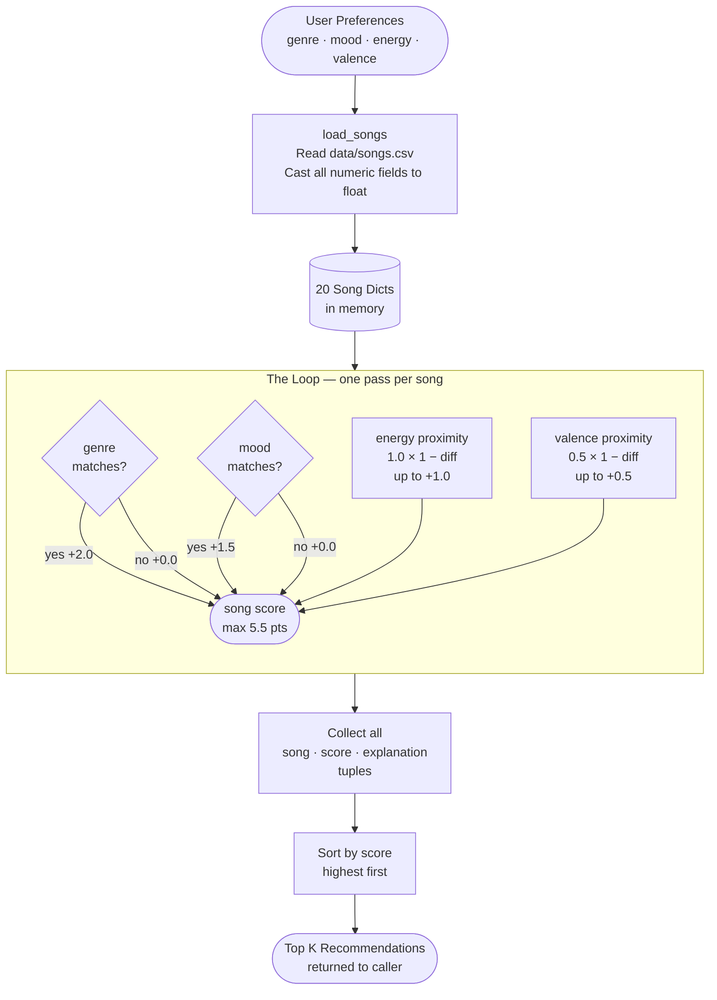

# 🎵 Music Recommender Simulation

## Project Summary

In this project you will build and explain a small music recommender system.

Your goal is to:

- Represent songs and a user "taste profile" as data
- Design a scoring rule that turns that data into recommendations
- Evaluate what your system gets right and wrong
- Reflect on how this mirrors real world AI recommenders

My version, recommends songs from a 20-song catalog by comparing each song's genre, mood, energy, and valence against what the user is looking for right now. It scores every song on a points scale (max 5.5) — genre match carries the most weight (+2.0), followed by mood (+1.5), energy closeness (up to +1.0), and valence closeness (up to +0.5) — then ranks all songs and returns the top 5. Each recommendation includes a plain-English explanation of why that song was chosen.

---

## How The System Works

Each Song stores 12 attributes loaded from data/songs.csv: id, title, artist, genre, mood, energy, tempo_bpm, valence, danceability, acousticness, instrumentalness, and speechiness.

A UserProfile stores four preferences: favorite_genre, favorite_mood, target_energy, and likes_acoustic.

### Data Flow



### Scoring Table

| Feature | Max Points | How it is measured |
|---|---|---|
| Genre match | +2.0 | Exact match only |
| Mood match | +1.5 | Exact match only |
| Energy closeness | +1.0 | `1.0 × (1 − │target − song.energy│)` |
| Valence closeness | +0.5 | `0.5 × (1 − │target − song.valence│)` |
| **Total max** | **5.5** | |

After scoring, all songs are sorted highest-to-lowest and the top `k` (default 5) are returned, each with a plain-English explanation of which features contributed points.

### Algorithm Recipe

This is the finalized set of rules the system uses to judge every song:

```
1. LOAD    → Read data/songs.csv, cast numeric columns to float

2. SCORE   → For each song, calculate:
               genre match?   +2.0  (exact label match, all-or-nothing)
               mood match?    +1.5  (exact label match, all-or-nothing)
               energy close?  +0.0 to +1.0  →  1.0 × (1 − |target − song.energy|)
               valence close? +0.0 to +0.5  →  0.5 × (1 − |target − song.valence|)
             Max possible score = 5.5

3. RANK    → Sort all scored songs highest-to-lowest
             Return top k (default k = 5) with explanations
```

**Why these weights:**
Genre (+2.0) is the strongest signal because a listener almost never crosses major genre boundaries regardless of other features. Mood (+1.5) captures *why* you are listening right now and outranks energy because two songs can have the same energy but completely different intent. Energy and valence are scored on a sliding scale because they exist on a spectrum — being close is still worth something, not just an exact hit.

### Expected Biases

- **Genre over-dominates:** A song that perfectly matches mood, energy, and valence but has the wrong genre still scores below a genre-match with nothing else in common. A great ambient song will lose to a mediocre lofi song for a lofi listener.
- **Mood and genre are all-or-nothing:** There is no partial credit for related labels. "Chill" and "relaxed" are treated as completely different even though they describe a similar state.
- **No artist diversity rule:** The ranking step does not prevent the same artist from filling all top-5 slots.
- **Fixed weights for everyone:** The system assumes every listener weights genre the same way. A mood-first listener (e.g. "I just want chill, genre doesn't matter") is poorly served.
- **Small catalog amplifies all of the above:** With only 20 songs, a single genre having 4 entries can dominate the top results even when those songs are not the best match overall.

---

## Getting Started

### Setup

1. Create a virtual environment (optional but recommended):

   ```bash
   python -m venv .venv
   source .venv/bin/activate      # Mac or Linux
   .venv\Scripts\activate         # Windows

2. Install dependencies

```bash
pip install -r requirements.txt
```

3. Run the app:

```bash
python -m src.main
```

### Running Tests

Run the starter tests with:

```bash
pytest
```

You can add more tests in `tests/test_recommender.py`.

---

## Terminal Output

```
Loaded songs: 20

==================================================
  Profile : Late Night Study
  Wants   : genre=lofi  mood=chill  energy=0.38  valence=0.58
==================================================
  #1  Library Rain
       Paper Lanterns  |  lofi / chill
       Score: 4.96 / 5.50
         • genre match (lofi) +2.0
         • mood match (chill) +1.5
         • energy 0.35 vs target 0.38 +0.97
         • valence 0.60 vs target 0.58 +0.49

  #2  Midnight Coding
       LoRoom  |  lofi / chill
       Score: 4.95 / 5.50
         • genre match (lofi) +2.0
         • mood match (chill) +1.5
         • energy 0.42 vs target 0.38 +0.96
         • valence 0.56 vs target 0.58 +0.49

  #3  Focus Flow
       LoRoom  |  lofi / focused
       Score: 3.47 / 5.50
         • genre match (lofi) +2.0
         • energy 0.40 vs target 0.38 +0.98
         • valence 0.59 vs target 0.58 +0.49

==================================================
  Profile : Workout Mode
  Wants   : genre=rock  mood=intense  energy=0.92  valence=0.45
==================================================
  #1  Storm Runner
       Voltline  |  rock / intense
       Score: 4.97 / 5.50
         • genre match (rock) +2.0
         • mood match (intense) +1.5
         • energy 0.91 vs target 0.92 +0.99
         • valence 0.48 vs target 0.45 +0.48

  #2  Bass Drop City
       Voltage  |  edm / intense
       Score: 2.88 / 5.50
         • mood match (intense) +1.5
         • energy 0.96 vs target 0.92 +0.96
         • valence 0.62 vs target 0.45 +0.42

==================================================
  Profile : Weekend Morning
  Wants   : genre=pop  mood=happy  energy=0.75  valence=0.82
==================================================
  #1  Sunrise City
       Neon Echo  |  pop / happy
       Score: 4.92 / 5.50
         • genre match (pop) +2.0
         • mood match (happy) +1.5
         • energy 0.82 vs target 0.75 +0.93
         • valence 0.84 vs target 0.82 +0.49

  #2  Gym Hero
       Max Pulse  |  pop / intense
       Score: 3.30 / 5.50
         • genre match (pop) +2.0
         • energy 0.93 vs target 0.75 +0.82
         • valence 0.77 vs target 0.82 +0.48
```

---

## Experiments You Tried

Three user profiles were tested against the 20-song catalog:

**Late Night Study** `{genre: lofi, mood: chill, energy: 0.38, valence: 0.58}`
Top results were *Library Rain* (4.96) and *Midnight Coding* (4.95) — both lofi/chill with near-identical energy. The third result, *Focus Flow*, scored 3.47 despite having the wrong mood, purely on the strength of the genre match and energy closeness. This shows genre (+2.0) alone can carry a song into the top 3 even without a mood hit.

**Workout Mode** `{genre: rock, mood: intense, energy: 0.92, valence: 0.45}`
*Storm Runner* scored 4.97 — a near-perfect match on all four features. The gap to second place (*Bass Drop City* at 2.88) was over 2 full points, entirely because the genre didn't match. This confirmed that genre weight dominates when there is only one song of that genre in the catalog.

**Weekend Morning** `{genre: pop, mood: happy, energy: 0.75, valence: 0.82}`
*Gym Hero* (pop/intense, 3.30) appeared in second place despite having the wrong mood. It scored there because the genre match (+2.0) outweighed the missing mood points (+1.5). This is the clearest example of the genre-over-mood bias in action.

---

## Limitations and Risks

- **20-song catalog** — too small for meaningful diversity; a single dominant genre can fill the top results
- **All-or-nothing labels** — genre and mood are binary matches; related labels like "chill" and "relaxed" score the same as completely unrelated pairs
- **No listening history** — every run produces the same output; the system cannot learn or adapt
- **Fixed weights** — genre always outweighs mood for every user, which is wrong for mood-first listeners
- **No artist diversity** — the same artist can appear in every top-5 slot
- **Missing features** — tempo preference, lyrics, language, and listener context (time of day, activity) are all absent

See [model_card.md](model_card.md) for a deeper analysis.

---

## Reflection

Full reflection and model analysis: [**model_card.md**](model_card.md)

Building this taught me that a recommender is really two steps: **scoring** (judge each song on its own) and **ranking** (pick the best ones from the full list). You need both — scoring alone gives you 20 numbers with nothing to compare, and ranking alone has nothing to sort.

The most eye-opening moment was *Gym Hero* showing up second on a "happy pop morning" playlist even though its mood is "intense." The genre label matched, and that was worth enough points to beat a song with the right mood. Changing one weight number fixed it — which showed how much the output depends on choices that look tiny in the code.

The strangest result came from testing a profile that wanted high-energy but sad music. The system returned a slow, quiet blues song at the top with a high score. The code was not broken. It just followed its rules, and the rules said the genre and mood labels mattered more than the energy gap. That is the core problem with fixed weights: they cannot adjust for what a specific person actually cares about most.

---
